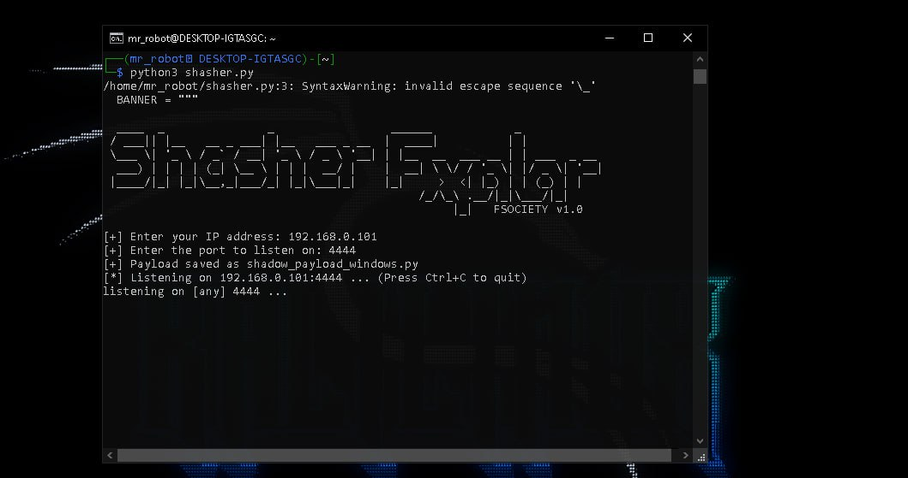

# ⚔️ Shasher Exploiter - FSOCIETY v1.0

> أداة هجومية لتوليد بايلودات وربط عكسي لأنظمة Windows  
> Offensive tool to generate Windows payloads and reverse shells

---

  
*واجهة الأداة / Tool interface*

---

## 📌 نبذة / About

🔹 **Shasher Exploiter** هي أداة مفتوحة المصدر تساعد مختبري الاختراق على توليد بايلودات مخصصة بلغة Python والاستماع إلى الاتصالات المرتدة.  
🔹 **Shasher Exploiter** is an open-source tool that helps penetration testers generate custom Python payloads and listen for reverse connections.

---

## 🚀 الميزات / Features

- ✅ توليد بايلود بايثون مخصص للويندوز  
  ✅ Generate custom Python payloads for Windows

- ✅ حفظ تلقائي للبايلود في ملف  
  ✅ Automatically saves the payload to a file

- ✅ واجهة بسيطة وسهلة الاستخدام  
  ✅ Simple and interactive CLI interface

- ✅ استماع مباشر للاتصال العكسي  
  ✅ Automatically starts listening for reverse connections

- ✅ تصميم ASCII أنيق  
  ✅ Cool ASCII art banner

---

## 🛠️ طريقة الاستخدام / Usage

```bash
git clone https://github.com/FsociteyF/Shasher.git
cd Shasher
python3 shasher.py
